# SkillCraft AI

## Description  
SkillCraft AI is an **innovative learning platform** developed using **Python (Flask)**, **HTML**, **CSS**, and **JavaScript**. The platform empowers learners by providing **structured roadmaps**, **customized reminders**, **progress tracking**, and **curated learning resources** to effectively master new skills. The website features a modern and responsive design, making it an engaging and user-friendly platform for learners.

## Special Features  
- **Responsive Design**: The website is fully optimized for all devices, ensuring a seamless browsing experience on desktops, tablets, and smartphones.  
- **Learning Roadmaps**: Structured, step-by-step guidance for mastering various skills.  
- **Smart Reminders**: Custom reminders to keep users on track with their learning schedule.  
- **Progress Tracking**: Real-time tracking of learning milestones and achievements.  
- **Curated Resources**: Hand-picked educational materials for enhanced learning.  
- **Interactive Design**: Visually engaging layout with smooth animations and transitions.

## How to Use SkillCraft AI  

1. **Register/Login**: Create an account or log in to access the platform.  
2. **Explore the Homepage**:  
   - View the **Skill Reminders** section to keep track of your learning.  
   - Check your **streak progress** to stay motivated.  
   - Discover **technologies you will gain** expertise in.  
3. **Start Learning**:  
   - Click on the **Learn Skill** section.  
   - Open any of the skill cards (e.g., **Backend Development** and **Web Development**).  
   - Explore the detailed **roadmap** for each skill.  
   - Access **documentation**, **video tutorials**, and **practice projects** for hands-on learning.  
4. **Track Progress**: View your learning statistics and receive personalized reminders to stay on track.  

## Application Screenshots  
 - 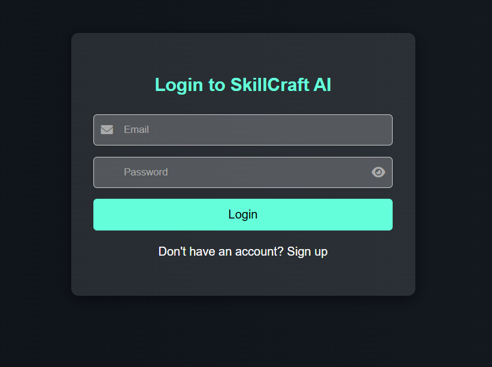
 - 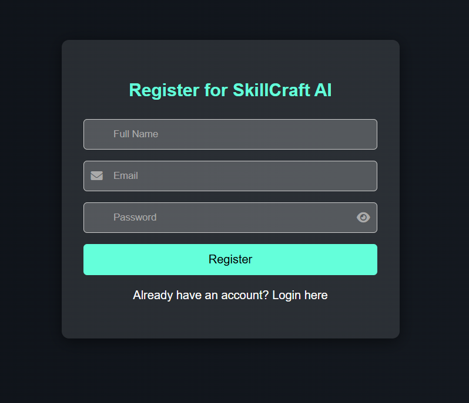
 - 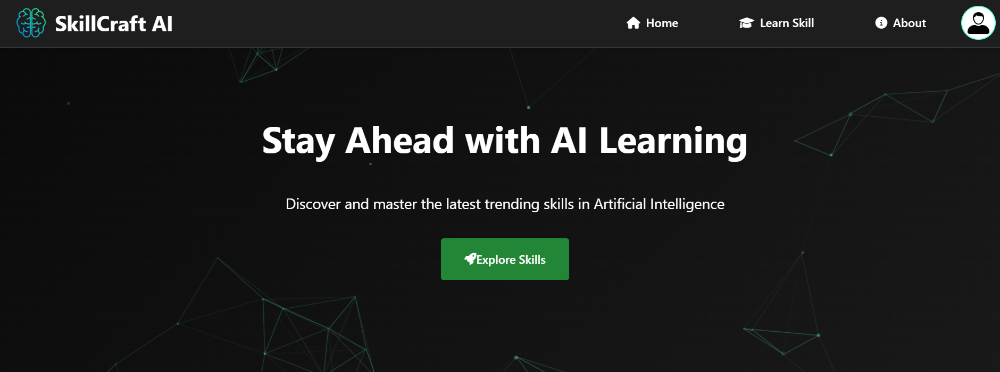
 - 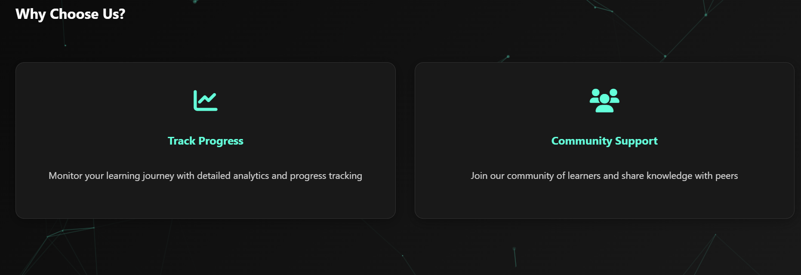
 - 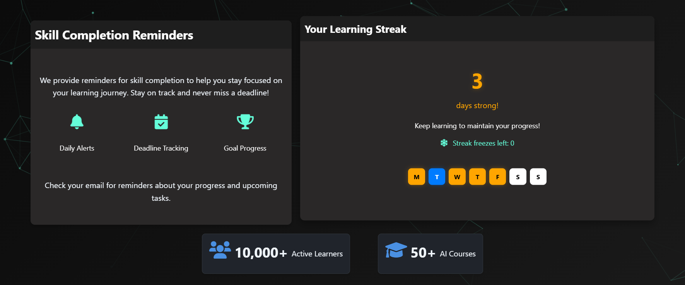
 - 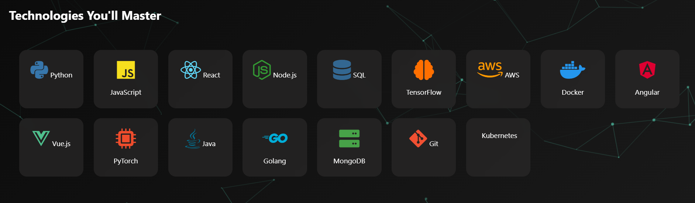
 - 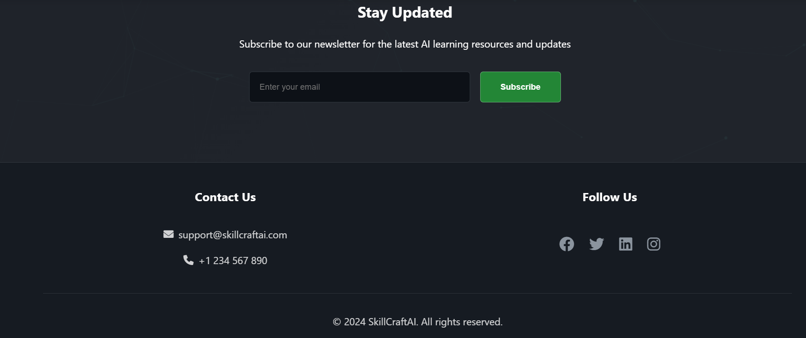
 - 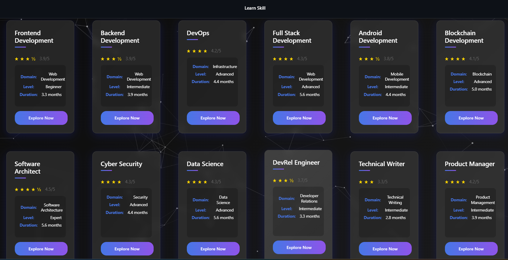
 - 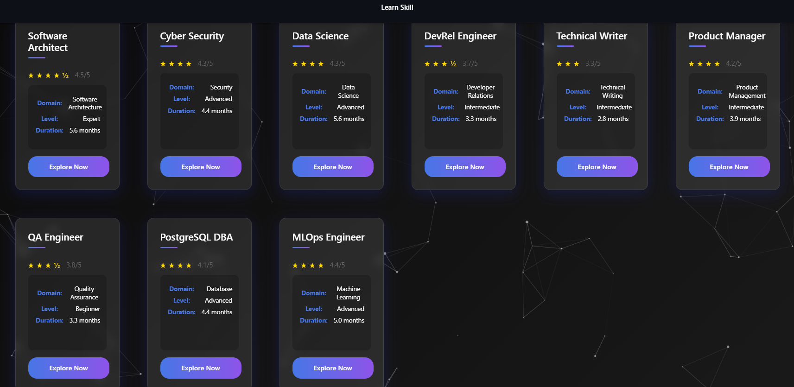
 - 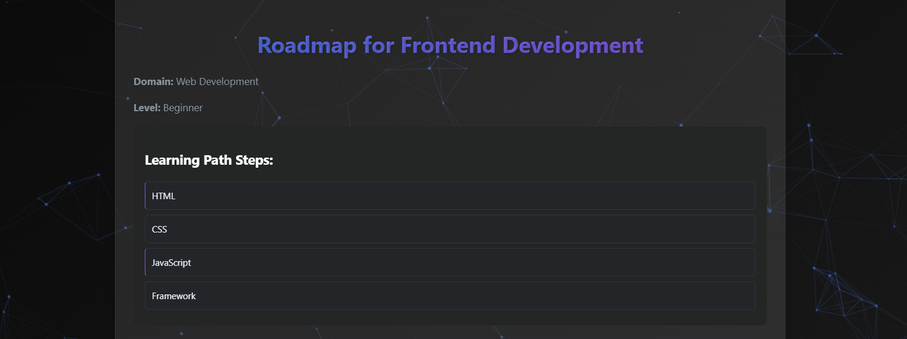
 - 
 - 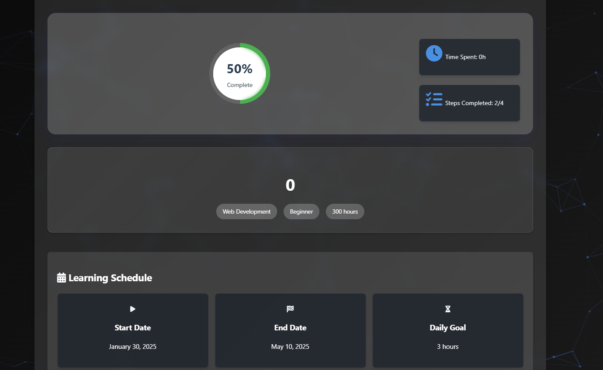
 - 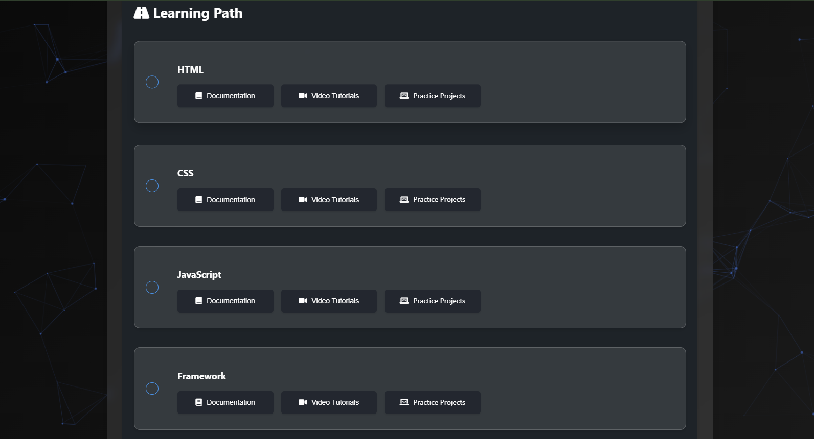
 - 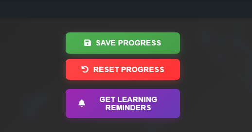
 - 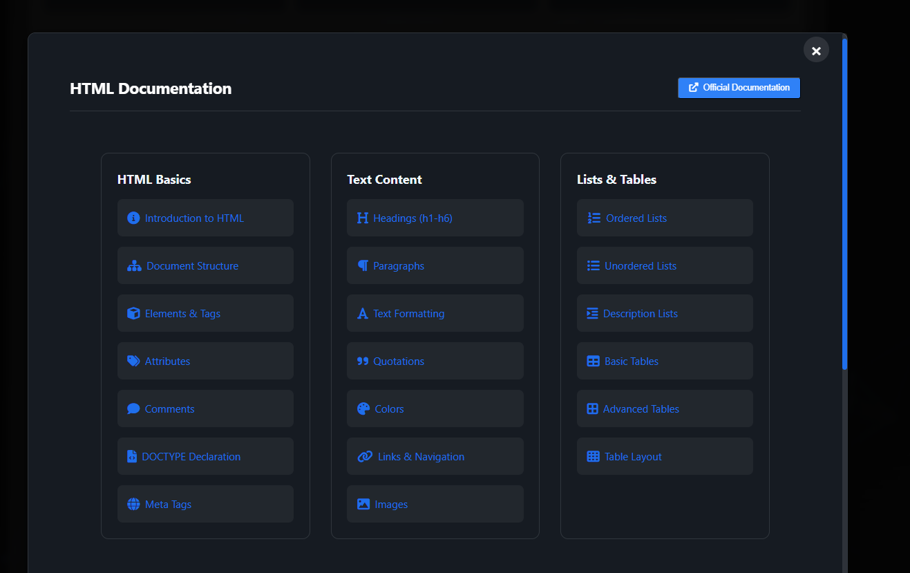
 - 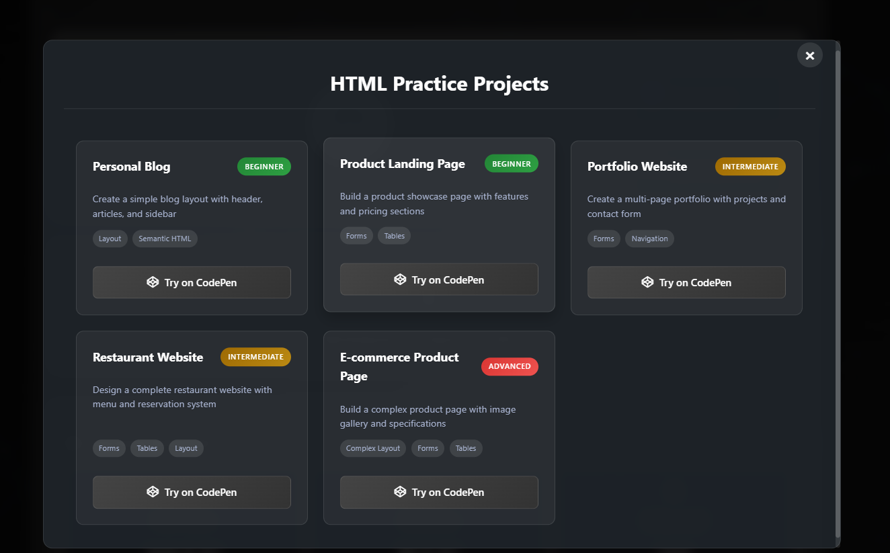
 - 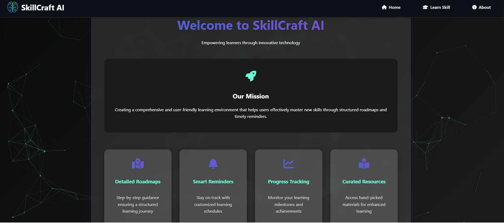
 - 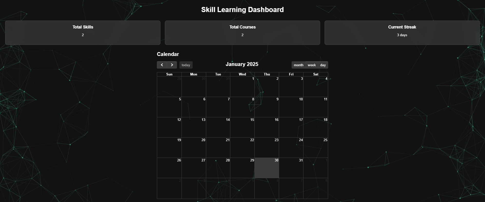
 - 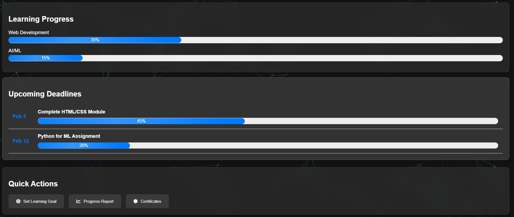
 - 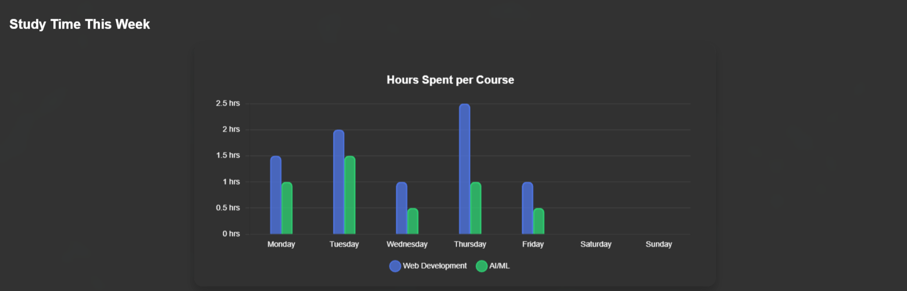

## Usage  
To explore SkillCraft AI:  
1. Run the Flask application by executing `python app.py` in your terminal.  
2. Enjoy the interactive features and explore the learning resources and tools.

## Installation  
To set up SkillCraft AI locally:  
1. Clone the repository from GitHub:
   - git clone https://github.com/raghuram1784/skillcraft-ai.git
     
2. Install the required dependencies:
   - pip install -r requirements.txt
3. Run the Flask application:
   - python app.py

 ## Technologies Used
- **Python (Flask)**: Backend development and API handling.
- **HTML**: Structure of the web pages.
- **CSS**: Styling and responsiveness.
- **JavaScript**: For animations and interactive features.
- **AOS**: Animations on scroll for enhanced user experience.
- **Particles.js**: Visual background effects for engaging design.
